# Effectiveness Radar

**A measurement framework for ranking team delivery capability across five axes: Speed, Accuracy, Defense, Strength, and Endurance.**

---

## What This Document Is

This is the project blueprint for building a complete, production-grade effectiveness measurement system. It covers the conceptual model, data requirements, ingestion strategies, scoring algorithms, visualization architecture, and a phased delivery plan. Every section is designed so you can hand it to a team, a tool, or yourself six months from now and pick up exactly where this leaves off.

---

## The Model

The Effectiveness Radar compresses project delivery history into five composite scores. Each score is derived from raw project-level data — not surveys, not gut feel, not manager opinion. The radar is a function of what actually happened.

```mermaid
graph TD
    subgraph "Raw Project Data (10 Fields)"
        TD["Target Delivery Date"]
        AD["Actual Delivery Date"]
        ER["Expected Revenue Increase"]
        AR["Actual Revenue Increase"]
        BC["Expected Cost of Security Breach"]
        SV["Number of Security Vulnerabilities"]
        EP["Expected Development Phases"]
        AP["Actual Phases Before Completion"]
        IP["Intersecting Projects"]
        RC["Reusable Components"]
    end

    subgraph "Five Axes"
        SPD["Speed"]
        ACC["Accuracy"]
        DEF["Defense"]
        STR["Strength"]
        END["Endurance"]
    end

    TD --> SPD
    AD --> SPD

    ER --> ACC
    AR --> ACC
    EP --> ACC
    AP --> ACC

    BC --> DEF
    SV --> DEF

    ER --> STR
    AR --> STR

    IP --> END
    RC --> END

    style SPD fill:#ef4444,stroke:#991b1b,color:#fff
    style ACC fill:#22c55e,stroke:#166534,color:#fff
    style DEF fill:#eab308,stroke:#a16207,color:#fff
    style STR fill:#22c55e,stroke:#166534,color:#fff
    style END fill:#ef4444,stroke:#991b1b,color:#fff
```

---

## The Five Axes — Definitions and Scoring

### Speed

**What it measures:** How punctually the team delivers relative to their own committed timelines.

**Inputs:** Target delivery date, actual delivery date.

**Scoring logic:**

```
plannedDuration = daysBetween(projectStartBaseline, targetDate)
slipDays        = max(0, daysBetween(targetDate, actualDate))
speed           = clamp(100 × (1 − (slipDays / plannedDuration) × 2.5))
```

The multiplier (2.5) controls sensitivity. A slip of 40% of the planned duration zeroes out the score. Early delivery caps at 100.

### Accuracy

**What it measures:** How closely the delivered outcome matched the plan — both financially and in scope.

**Inputs:** Expected revenue, actual revenue, expected phases, actual phases.

**Scoring logic:**

```
revAccuracy   = clamp(100 − |1 − actualRevenue / expectedRevenue| × 200)
phaseAccuracy = clamp(100 − |actualPhases − expectedPhases| / expectedPhases × 150)
accuracy      = 0.5 × revAccuracy + 0.5 × phaseAccuracy
```

Revenue accuracy captures whether the business case held. Phase accuracy captures scope discipline — did the work expand or contract beyond what was planned?

### Defense

**What it measures:** How securely the project was delivered, weighted by the stakes.

**Inputs:** Expected cost of security breach, number of security vulnerabilities.

**Scoring logic:**

```
breachWeight = expectedBreachCost / 500000
rawDefense   = 100 − vulnerabilities × 18
defense      = clamp(rawDefense − (breachWeight × 10 if vulns > 0))
```

This is intentionally asymmetric. A vulnerability on a $500k-breach-risk system is not the same as one on a $50k system. The breach cost acts as a severity multiplier that amplifies the penalty per vulnerability.

### Strength

**What it measures:** How much value the deliverable actually brought to the table.

**Inputs:** Expected revenue, actual revenue.

**Scoring logic:**

```
strength = clamp(actualRevenue / expectedRevenue × 100)
```

This is the simplest axis. Did the project deliver at least what it promised? Over-delivery caps at 100, under-delivery scales linearly.

### Endurance

**What it measures:** How this delivery affects the likelihood of future deliveries landing — the compound effect.

**Inputs:** Intersecting projects, reusable components.

**Scoring logic:**

```
reuse     = clamp((reusableComponents / 8) × 50, 0, 50)
cross     = clamp((intersectingProjects / 5) × 50, 0, 50)
endurance = reuse + cross
```

A project that ships in isolation with no reusable parts is a dead end. A project that produces shared libraries, templates, or patterns and connects to other active workstreams compounds future delivery capacity.

---

## Tier Classification

| Tier | Range | Meaning |
|------|-------|---------|
| HIGH | 75–100 | Consistent strength in this axis |
| MID | 45–74 | Functional but not reliable |
| LOW | 0–44 | Structural weakness, needs intervention |

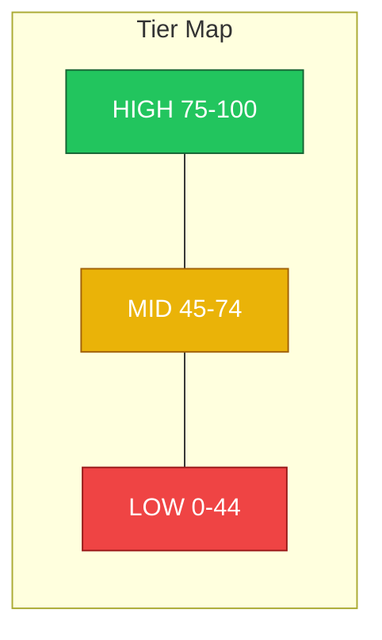

---

## Data Dictionary

Every project in the dataset requires exactly 10 fields. No more, no fewer.

| # | Field | Type | Example | Feeds Into |
|---|-------|------|---------|------------|
| 1 | Target Delivery Date | ISO date | 2025-03-01 | Speed |
| 2 | Actual Delivery Date | ISO date | 2025-05-20 | Speed |
| 3 | Expected Revenue Increase | USD integer | 500000 | Accuracy, Strength |
| 4 | Actual Revenue Increase | USD integer | 490000 | Accuracy, Strength |
| 5 | Expected Cost of Security Breach | USD integer | 220000 | Defense |
| 6 | Number of Security Vulnerabilities | integer ≥ 0 | 3 | Defense |
| 7 | Expected Development Phases | integer ≥ 1 | 5 | Accuracy |
| 8 | Actual Phases Before Completion | integer ≥ 1 | 5 | Accuracy |
| 9 | Intersecting Projects | integer ≥ 0 | 1 | Endurance |
| 10 | Reusable Components | integer ≥ 0 | 1 | Endurance |

---

## Data Generation Strategies

This is the hard part. The radar is only as honest as the data feeding it. Below are the practical approaches for generating each field, organized by data source.

### Strategy Map

```mermaid
flowchart TD
    subgraph "Project Management Tools"
        PM["Jira / Azure DevOps / Asana / Monday"]
        PM --> |"sprint/epic dates"| F1["Target Date"]
        PM --> |"last ticket closed"| F2["Actual Date"]
        PM --> |"epic count or milestones"| F7["Expected Phases"]
        PM --> |"actual milestone count"| F8["Actual Phases"]
    end

    subgraph "Finance & Business Systems"
        FIN["Revenue tracking / ERP / BI dashboards"]
        FIN --> |"business case projection"| F3["Expected Revenue"]
        FIN --> |"post-launch actuals"| F4["Actual Revenue"]
    end

    subgraph "Security Tools"
        SEC["SAST / DAST / SCA / Pen Tests"]
        SEC --> |"scan results at release"| F6["Vulnerabilities"]
    end

    subgraph "Risk Assessment"
        RISK["Risk register / compliance team"]
        RISK --> |"breach impact estimate"| F5["Breach Cost"]
    end

    subgraph "Architecture & Dependency Maps"
        ARCH["Service catalog / dependency graphs"]
        ARCH --> |"upstream/downstream count"| F9["Intersecting Projects"]
        ARCH --> |"shared libs, APIs, templates"| F10["Reusable Components"]
    end

    style PM fill:#1e40af,stroke:#1e3a8a,color:#fff
    style FIN fill:#166534,stroke:#14532d,color:#fff
    style SEC fill:#991b1b,stroke:#7f1d1d,color:#fff
    style RISK fill:#a16207,stroke:#854d0e,color:#fff
    style ARCH fill:#6b21a8,stroke:#581c87,color:#fff
```

### Field-by-Field Collection Guide

**Fields 1–2: Target Date and Actual Date**

These are the easiest to collect and the hardest to define honestly. "Target date" must mean the originally committed date at project kickoff, not the re-baselined date after the third slip. "Actual date" must mean production-ready, not "code complete" or "in staging."

Sources: Jira epic target dates, Azure DevOps iteration paths, release management logs, change advisory board (CAB) records, deployment pipeline timestamps.

Approach options:

- **Manual:** PM fills in a spreadsheet at project close. Low cost, high variance, easy to game.
- **Semi-automated:** Pull epic/milestone dates from Jira API at project close. PM validates.
- **Fully automated:** CI/CD pipeline records the first successful production deploy timestamp. Compare against the epic's original `fixVersion` target date in Jira.

**Fields 3–4: Expected Revenue and Actual Revenue**

Revenue attribution is the most contested measurement in any organization. The expected figure comes from the business case or project charter. The actual figure requires a measurement window and an attribution model.

Sources: Business case documents, finance team projections, BI dashboards (Looker, Tableau, Power BI), ERP systems.

Approach options:

- **Direct attribution:** Project X launched feature Y, feature Y generated $Z in the first 90 days. Works for revenue-generating features with clean attribution.
- **Proxy attribution:** Project X reduced churn by N%, churn reduction maps to $Z in retained revenue. Requires a model.
- **Cost avoidance:** Project X automated a process that previously cost $Z/year in labor. Revenue is the avoided cost.
- **Executive estimate:** Finance and product leadership agree on a number post-launch. Fastest, least rigorous.

**Field 5: Expected Cost of Security Breach**

This is a risk assessment input, not a measured output. It represents the estimated financial impact if the system this project touches were breached.

Sources: Risk registers, compliance team assessments, industry benchmarks (Ponemon, IBM Cost of a Data Breach Report), insurance underwriting.

Approach options:

- **Per-system classification:** Assign each system a tier (critical/high/medium/low) with a dollar range per tier. Map projects to systems.
- **Data sensitivity model:** Count PII records, PCI scope, PHI exposure. Multiply by per-record breach cost benchmarks.
- **Insurance-based:** Use the organization's cyber insurance policy limits or deductible as a proxy for breach cost per system.

**Field 6: Vulnerabilities**

Count of known security vulnerabilities in the project's deliverable at the time of release.

Sources: SAST tools (SonarQube, Checkmarx, Semgrep), DAST tools (OWASP ZAP, Burp Suite), SCA tools (Snyk, Dependabot), penetration test reports.

Approach options:

- **Scan at release gate:** Run SAST/DAST/SCA as part of the CI/CD pipeline. Count findings above a severity threshold (e.g., medium+) at the moment the release is approved.
- **Pen test findings:** Use the count of findings from the most recent penetration test scoped to this project.
- **Aggregated:** Sum of all findings from all tools, deduplicated.

**Fields 7–8: Expected Phases and Actual Phases**

"Phase" must be defined consistently. It could mean sprints, milestones, development stages (design → build → test → deploy), or formal project phases (initiation → planning → execution → closure).

Sources: Project charter, Jira epic breakdown, milestone definitions, retrospective records.

Approach options:

- **Sprint-based:** Expected = planned sprint count at kickoff. Actual = total sprints consumed.
- **Milestone-based:** Expected = number of milestones in the project plan. Actual = number of milestones actually created/completed.
- **Stage-gate:** Expected = formal stage gates defined in methodology. Actual = gates traversed including any added phases.

**Field 9: Intersecting Projects**

Count of other active projects that share dependencies, teams, infrastructure, or deliverables with this project.

Sources: Dependency graphs, resource allocation tools, service catalogs, architecture diagrams.

Approach options:

- **Manual tagging:** PM identifies related projects at kickoff and close.
- **Shared resource analysis:** Count projects that share ≥1 team member or ≥1 service dependency.
- **Service mesh analysis:** If you have a service catalog, count upstream and downstream services touched by this project's changes. Each service maps to its own project.

**Field 10: Reusable Components**

Count of artifacts from this project that are designed for reuse: shared libraries, API endpoints, templates, design system components, infrastructure modules, documentation templates.

Sources: Internal package registries, shared repositories, design system catalogs, Terraform module registries, API gateway configurations.

Approach options:

- **Registry count:** Count packages published to internal registries (npm, PyPI, Maven) as part of this project.
- **API surface:** Count new API endpoints that are consumed by other teams.
- **Architecture review:** Architect identifies reusable artifacts at project close.

---

## Integration Architecture

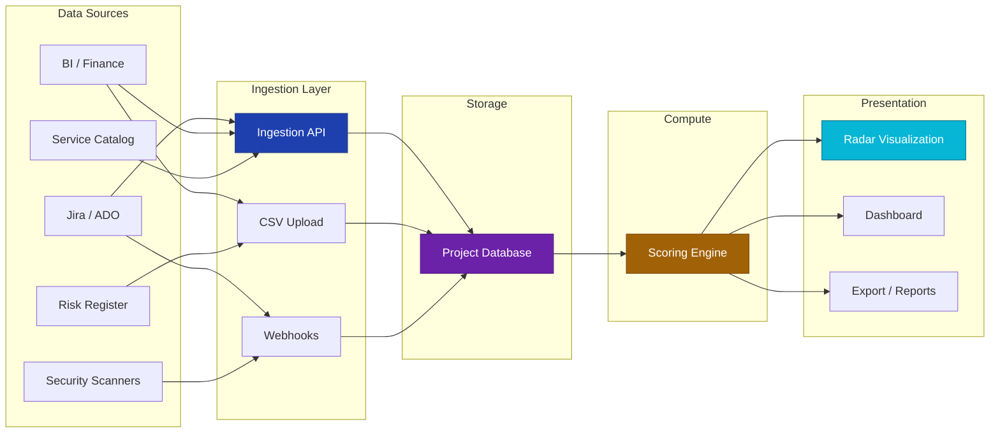

---

## System Architecture — Full Target State

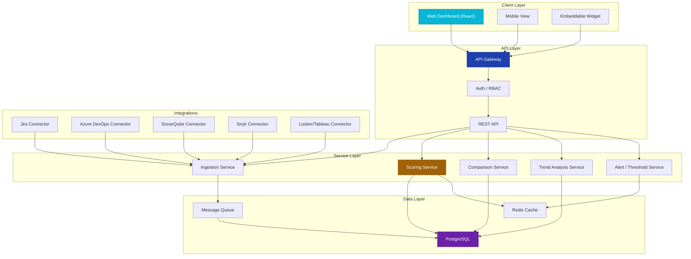

---

## Database Schema

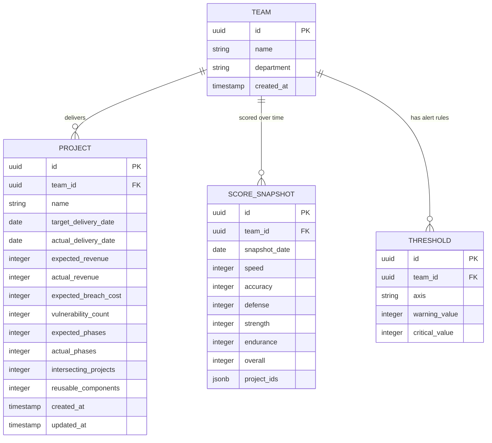

---

## Comparison Modes

The radar is useful for a single team, but it becomes powerful when used comparatively.

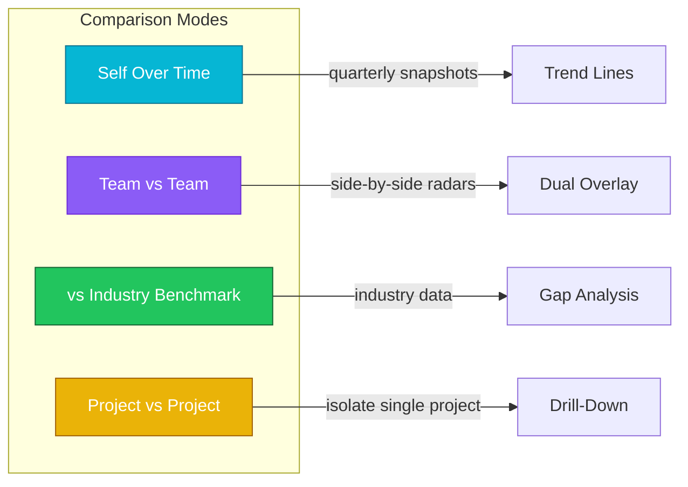

---

## Phased Delivery Plan

This project is designed to be built incrementally. Each phase produces something usable. No phase requires all prior phases to be fully automated — you can run earlier phases manually while building later ones.

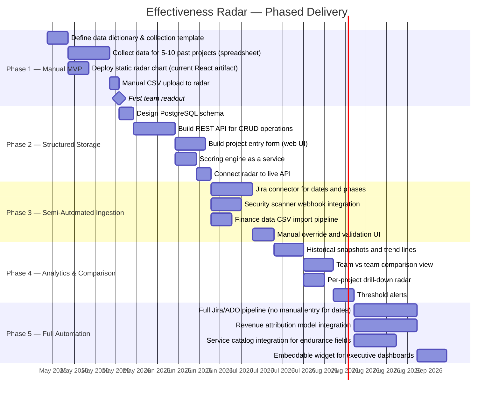

---

## Phase Details

### Phase 1 — Manual MVP

**Goal:** Produce the first real radar for your team using manually collected data.

**Deliverables:**

- A Google Sheet or Excel template with all 10 fields, one row per project.
- The React radar component (already built) consuming a JSON array.
- A team-level readout: "Here is where we stand."

**What you learn:** Whether the 10 fields are sufficient, whether the scoring weights feel right, and where the data gaps are.

**Effort:** 1–2 weeks, 1 person.

### Phase 2 — Structured Storage

**Goal:** Move from spreadsheet to database. Build the API that the radar reads from.

**Deliverables:**

- PostgreSQL schema (teams, projects, score snapshots, thresholds).
- REST API with endpoints for creating/reading/updating projects and fetching computed scores.
- A basic web form for entering project data.
- Scoring engine running server-side, returning computed axes on demand.

**What you learn:** Whether the data model holds up across multiple teams. Whether the scoring engine produces believable results at scale.

**Effort:** 3–4 weeks, 1–2 engineers.

### Phase 3 — Semi-Automated Ingestion

**Goal:** Reduce manual data entry by pulling what you can from existing tools.

**Deliverables:**

- Jira connector that pulls target dates (from epic `fixVersion`), actual dates (from last subtask resolution), and phase counts (from epic milestone structure).
- Webhook receiver for security scanners (SonarQube, Snyk) that writes vulnerability counts on scan completion.
- CSV import pipeline for finance data (expected and actual revenue).
- Validation UI where a PM can review auto-populated fields before they commit.

**What you learn:** What percentage of data can be auto-populated, and which fields still require human judgment.

**Effort:** 4–6 weeks, 2 engineers.

### Phase 4 — Analytics and Comparison

**Goal:** Make the radar a decision tool, not just a display.

**Deliverables:**

- Score snapshots stored monthly or quarterly, with trend line visualization.
- Side-by-side team comparison (overlay two radars).
- Per-project drill-down (click a project, see its individual radar).
- Configurable threshold alerts: "If speed drops below 40, notify the engineering director."

**What you learn:** Whether teams respond to the data, whether comparison drives improvement or defensiveness, whether thresholds are calibrated correctly.

**Effort:** 4–5 weeks, 2 engineers.

### Phase 5 — Full Automation

**Goal:** Zero manual entry for the fields that can be automated. Human review only where judgment is required.

**Deliverables:**

- Full Jira/ADO pipeline: dates and phases are never manually entered.
- Revenue attribution model integration with the BI layer.
- Service catalog integration for intersecting projects and reusable components.
- Embeddable widget that can drop into Confluence, SharePoint, or executive dashboards.

**What you learn:** The steady-state operating cost of the system and whether it sustains itself without a dedicated operator.

**Effort:** 6–8 weeks, 2–3 engineers.

---

## Decision Tree: Which Approach Should You Start With?

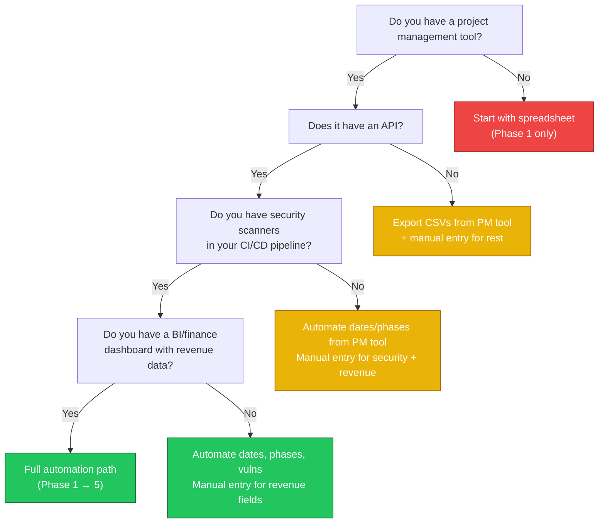

---

## Scoring Calibration — Tuning the Weights

The scoring formulas contain constants that control sensitivity. These should be tuned per organization.

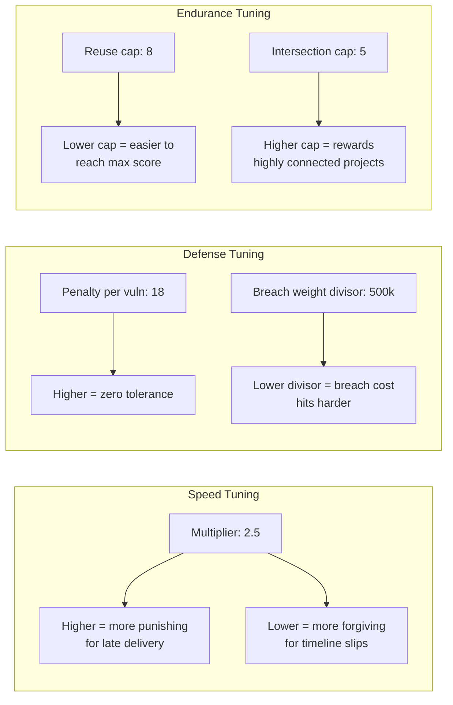

| Parameter | Default | What It Controls | When to Increase | When to Decrease |
|-----------|---------|-----------------|-------------------|-------------------|
| Speed multiplier | 2.5 | How fast the score drops per day of slip | Team consistently ships late and there's no pressure | Team is in a research/innovation phase where timelines are intentionally loose |
| Vuln penalty | 18 | Points lost per vulnerability | Security is a top organizational priority | Team works on low-risk internal tools |
| Breach weight divisor | 500,000 | Normalizes breach cost into the 0-1 range | Your highest-risk systems have breach costs > $500k | All systems are below $100k breach cost |
| Reuse cap | 8 | Max reusable components for full score | You want to reward high-volume component producers | Most projects only produce 1-2 reusable things |
| Intersection cap | 5 | Max intersecting projects for full score | You want to reward broad cross-team collaboration | Teams are intentionally siloed by design |

---

## File Structure — Target Repository Layout

```mermaid
flowchart TD
    ROOT["effectiveness-radar/"] --> DOCS["docs/"]
    ROOT --> FRONTEND["frontend/"]
    ROOT --> BACKEND["backend/"]
    ROOT --> INFRA["infra/"]
    ROOT --> DATA["data/"]
    ROOT --> SCRIPTS["scripts/"]

    DOCS --> D1["README.md (this file)"]
    DOCS --> D2["data-dictionary.md"]
    DOCS --> D3["scoring-algorithms.md"]
    DOCS --> D4["calibration-guide.md"]
    DOCS --> D5["integration-playbook.md"]

    FRONTEND --> F1["src/components/RadarChart.jsx"]
    FRONTEND --> F2["src/components/ProjectTable.jsx"]
    FRONTEND --> F3["src/components/ScoreBreakdown.jsx"]
    FRONTEND --> F4["src/components/ComparisonView.jsx"]
    FRONTEND --> F5["src/components/TrendLine.jsx"]
    FRONTEND --> F6["src/hooks/useScoring.ts"]
    FRONTEND --> F7["src/types/project.ts"]

    BACKEND --> B1["src/api/projects.ts"]
    BACKEND --> B2["src/api/scores.ts"]
    BACKEND --> B3["src/api/teams.ts"]
    BACKEND --> B4["src/services/scoring.ts"]
    BACKEND --> B5["src/services/ingestion.ts"]
    BACKEND --> B6["src/connectors/jira.ts"]
    BACKEND --> B7["src/connectors/sonarqube.ts"]
    BACKEND --> B8["src/db/schema.sql"]

    INFRA --> I1["docker-compose.yml"]
    INFRA --> I2["terraform/"]

    DATA --> DA1["sample-projects.json"]
    DATA --> DA2["collection-template.xlsx"]

    SCRIPTS --> SC1["import-csv.ts"]
    SCRIPTS --> SC2["snapshot-scores.ts"]
    SCRIPTS --> SC3["calibrate.ts"]
```

---

## Adapting to Any Team or Workflow

The 10-field model is intentionally generic. Here's how it maps to different team types.

### Software Engineering Teams

Dates come from Jira/ADO. Revenue comes from product/finance. Vulnerabilities come from security scanners. Phases are sprints or milestones. Intersecting projects are service dependencies. Reusable components are shared packages or APIs.

### Marketing / Creative Teams

Target date = campaign launch date. Actual date = actual launch. Revenue = expected vs actual campaign ROI. Breach cost = brand damage estimate (reputational risk). Vulnerabilities = compliance violations or brand guideline deviations. Phases = creative rounds (brief → concept → review → final). Intersecting projects = concurrent campaigns sharing audience or budget. Reusable components = templates, brand assets, copy frameworks.

### Operations / Infrastructure Teams

Target date = planned go-live. Actual date = production cutover. Revenue = cost savings or efficiency gains. Breach cost = downtime cost per hour × estimated exposure. Vulnerabilities = configuration drift findings or audit gaps. Phases = implementation stages. Intersecting projects = dependent systems. Reusable components = IaC modules, runbooks, monitoring templates.

### Consulting / Professional Services

Target date = SOW delivery date. Actual date = client acceptance date. Revenue = contract value. Breach cost = liability exposure or penalty clauses. Vulnerabilities = client-reported defects. Phases = SOW milestones. Intersecting projects = shared client engagements. Reusable components = deliverable templates, methodologies, accelerators.

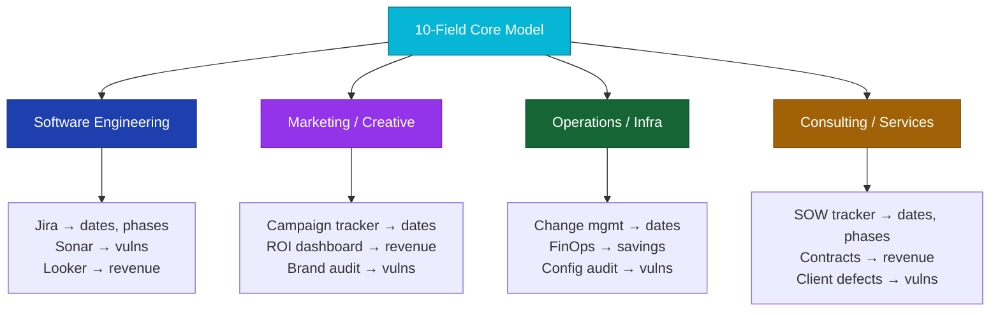

---

## What's Already Built

The current artifact (`effectiveness.jsx`) is the Phase 1 visualization layer. It includes:

- Radar chart with five axes, grid lines, glow effects, tier-colored nodes.
- Interactive project table with all 10 fields, row selection for per-project isolation.
- Score derivation panel showing formulas, inputs, and computed values.
- Tier classification (HIGH/MID/LOW) with color coding.
- Sample dataset shaped to a Hyatt-like team profile (high accuracy/strength, mid defense, low speed/endurance).

**Next step:** Replace the sample data with your real project data. Start with 5–10 completed projects. Use the collection template.

---

## Open Questions for Calibration

These are the questions you'll want to answer after running the first real dataset through the system:

1. **Is the speed multiplier (2.5) right for your culture?** If every project scores 0 on speed, the multiplier is too aggressive. If every project scores 90+, it's too lenient.
2. **Should accuracy weight revenue and phases equally (50/50)?** Some teams care more about scope discipline than revenue accuracy, or vice versa.
3. **Is 18 points per vulnerability the right penalty?** This depends entirely on your security posture and risk tolerance.
4. **Should the breach cost divisor ($500k) be org-specific?** If your highest-risk system has a $2M breach cost, $500k as the normalizer may be too low.
5. **Are the endurance caps (8 components, 5 intersections) realistic?** If no project in your history has ever produced 8 reusable components, the cap is aspirational, which might be what you want — or it might permanently depress the score.
6. **Should overall score be a simple average of the five axes, or should axes be weighted?** A team that's fast but insecure is not the same as a team that's slow but bulletproof. The current model treats them as equivalent.
