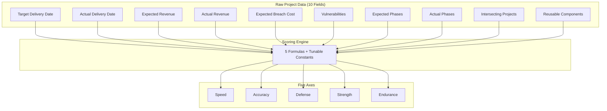
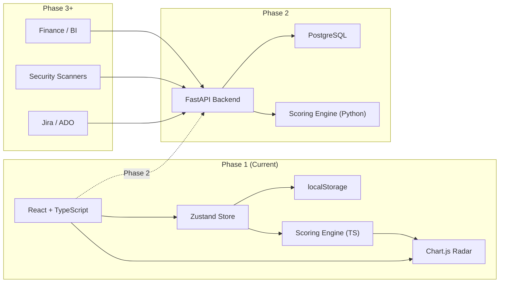
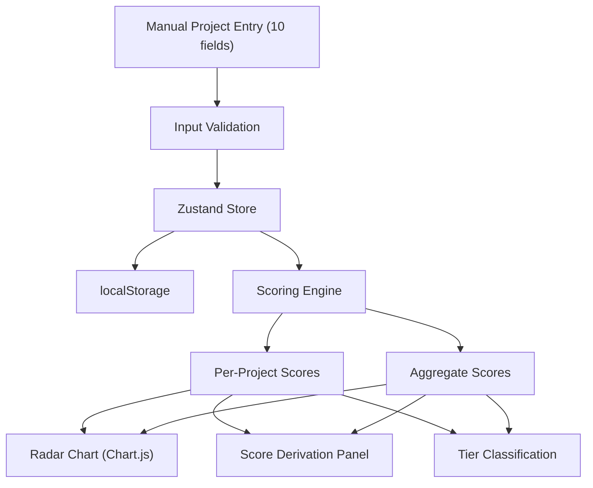
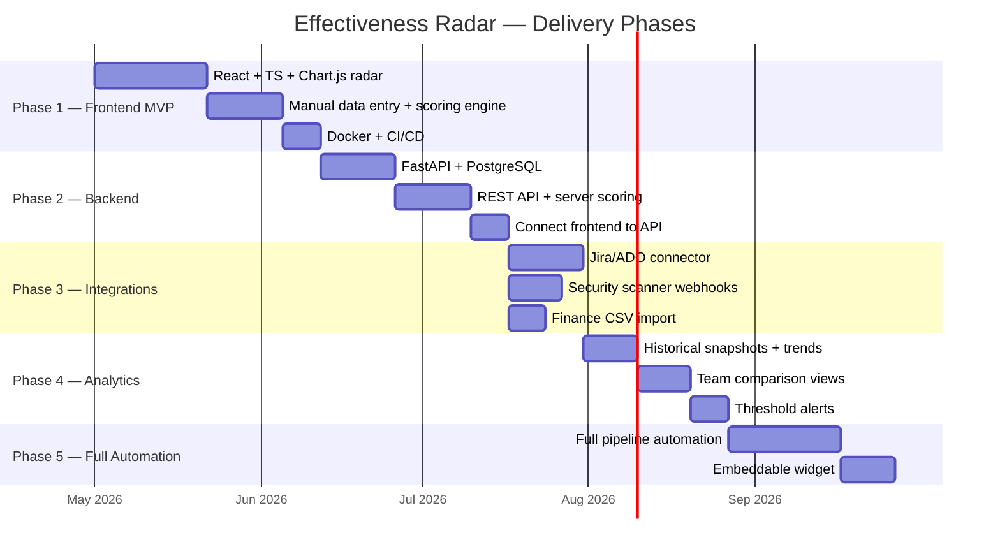

# Effectiveness Radar

A measurement framework for ranking team delivery capability across five axes: **Speed**, **Accuracy**, **Defense**, **Strength**, and **Endurance**.

---

## What This Is

The Effectiveness Radar compresses project delivery history into five composite scores derived from raw project-level data — not surveys, not gut feel, not manager opinion. Each project provides exactly 10 input fields; the scoring engine transforms them into a radar chart that shows team capability at a glance.



---

## The Five Axes

| Axis | What It Measures | Inputs |
|------|-----------------|--------|
| **Speed** | Delivery punctuality relative to committed timelines | Target date, actual date |
| **Accuracy** | How closely the outcome matched the plan (financial + scope) | Expected/actual revenue, expected/actual phases |
| **Defense** | Security posture weighted by breach risk | Breach cost, vulnerabilities |
| **Strength** | Raw value delivered vs. promised | Expected/actual revenue |
| **Endurance** | Compound effect on future deliveries | Intersecting projects, reusable components |

### Tier Classification

| Tier | Range | Meaning |
|------|-------|---------|
| HIGH | 75-100 | Consistent strength |
| MID | 45-74 | Functional but not reliable |
| LOW | 0-44 | Structural weakness |

---

## Architecture



---

## Data Flow



---

## Phased Delivery



---

## Tech Stack

| Layer | Technology |
|-------|-----------|
| Frontend | React 18 + TypeScript strict + Vite |
| UI Framework | react-bootstrap + Bootstrap 5 |
| Charting | Chart.js via react-chartjs-2 |
| State | Zustand |
| Testing | Vitest + React Testing Library |
| Package Manager | pnpm |
| Container | Docker (multi-stage node + nginx) |
| CI/CD | GitLab CI |
| Backend (Phase 2) | FastAPI + SQLAlchemy + Pydantic |
| Database (Phase 2) | PostgreSQL 16 |

---

## Quick Start

### With Docker
```bash
./run_engineering_effectiveness.sh    # macOS/Linux
run_engineering_effectiveness.bat     # Windows
# Opens http://localhost:5173
# Interactive menu: [k] stop, [q] stop+cleanup, [v] full cleanup, [r] restart
```

### Without Docker
```bash
cd frontend
pnpm install
pnpm dev
# http://localhost:5173
```

---

## Scoring Formulas

All scores are 0-100 integers with tunable constants.

- **Speed:** `clamp(100 * (1 - (slipDays / plannedDuration) * 2.5))` — 40% slip zeroes out the score
- **Accuracy:** `0.5 * revAccuracy + 0.5 * phaseAccuracy` — revenue and scope discipline weighted equally
- **Defense:** `100 - vulns * 18 - breachWeight * 10` — breach cost amplifies vulnerability penalty
- **Strength:** `clamp(actualRevenue / expectedRevenue * 100)` — linear value delivery
- **Endurance:** `(reuse/8 * 50) + (intersections/5 * 50)` — reuse + cross-pollination

See `ENGINEERING_EFFECTIVENESS_MASTER_PLAN.md` for full formula details, constants, and calibration guidance.

---

## Project Structure

```
engineering-effectiveness/
├── CLAUDE.md                           # AI operational guidelines
├── ENGINEERING_EFFECTIVENESS_MASTER_PLAN.md
├── README.md                           # This file
├── effectiveness.jsx                   # Original prototype (reference)
├── docs/                               # Project documentation
├── .claude/                            # Claude Code hooks + commands
├── frontend/                           # React + TypeScript app
├── docker-compose.yml
├── run_engineering_effectiveness.sh
├── run_engineering_effectiveness.bat
├── .gitignore
└── .gitlab-ci.yml
```

---

## Documentation

- `ENGINEERING_EFFECTIVENESS_MASTER_PLAN.md` — Comprehensive spec: scoring algorithms, data dictionary, integration architecture, phased delivery plan
- `CLAUDE.md` — AI development guidelines, data contracts, phase constraints
- `docs/status.md` — Current project state
- `docs/versions.md` — Version changelog